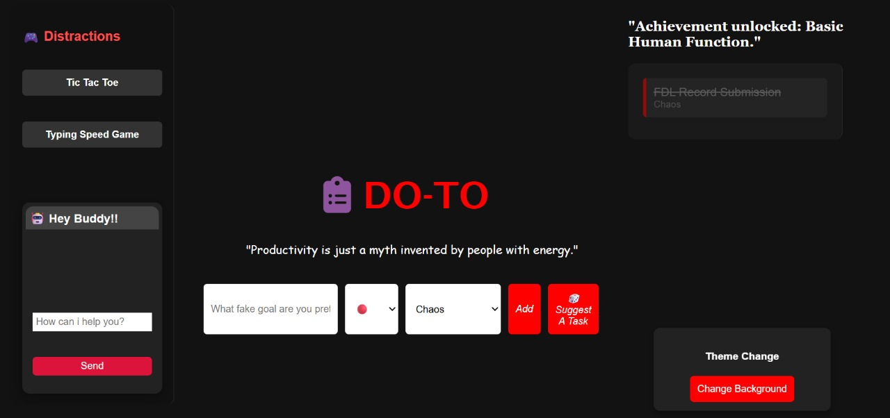

# DO - TO : Productivity is just a myht invented by people with energy.  🎯

## Basic Details
### Team Name: MindMesh

### Team Members
- Team Lead: ASHWINI M SHENOY - SCMS SCHOOL OF ENGINEERING AND TECHNOLOGY
- Member 2: GOWRI DHANYA RAJ - SCMS SCHOOL OF ENGINEERING AND TECHNOLOGY

### Project Description
An outrageously mischievous task manager that not only lets you add, edit, pin, and delete tasks but also tempts you with built-in mini-games like Tic Tac Toe and a typing speed test—perfect for glorious procrastination.
Fueled by random “evil” task suggestions and dripping with dark humor, it transforms productivity into a wickedly entertaining challenge you’ll almost enjoy losing.

### The Problem (that doesn't exist)
It solves the “problem” of being too productive by replacing dull to-do lists with one that mocks you, tempts you with games, and offers “evil” suggestions—while pretending to help

### The Solution (that nobody asked for)
By combining a snarky task manager with built-in distractions— villain-style themes, random “evil” task suggestions, and procrastination-fueling mini-games—all wrapped in the guise of productivity.

## Technical Details
### Technologies/Components Used
For Software:
- Languages used: HTML, CSS, JavaScript
- Tools used: Any modern web browser (Chrome, Edge, Firefox) for running the app

### Implementation
For Software:
# Installation
    No build system or external depedencies required.

### Project Documentation
For Software:
    Code Structure:
        index.html → Main webpage structure
        style.css → Styling, including theme modes (lazy, villain)
        app.js → Core logic for task management, theme switching, evil narration, and mini-games

    Key Features:
        Add, edit, pin, and delete tasks with sarcastic voice feedback
        Color-coded tasks
        Random “evil” task suggestions (forces black color)
        Built-in games: Tic Tac Toe with smart bot + Typing Speed Test
        Theme switcher (Lazy, Villain modes)

# Screenshots

The Initial Page with all the components.

A task is added to the list.

Task completed is shown.

Typing game is being played.

## Team Contributions
- ASHWINI M SHENOY : Feature refining
- GOWRI DHANYA RAJ : Design and Style

---
Made with ❤️ at TinkerHub Useless Projects 

